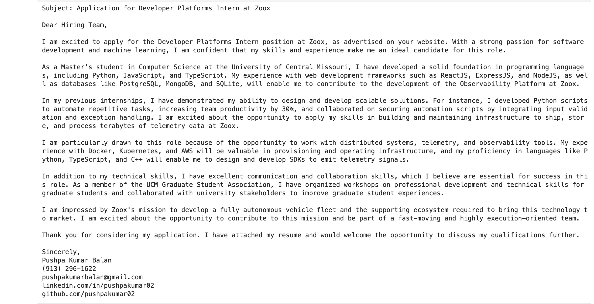

# Cold Email Generator

This tool allows users to generate personalized cold emails for service companies using Groq, Langchain, Llama3.1 and Streamlit. Users can input the job description URL from a company's careers page. The tool then extracts the job description from that page and generates a personalized cold email. The email includes relevant skills from the resume, sourced from a vector database, based on the specific job description.

